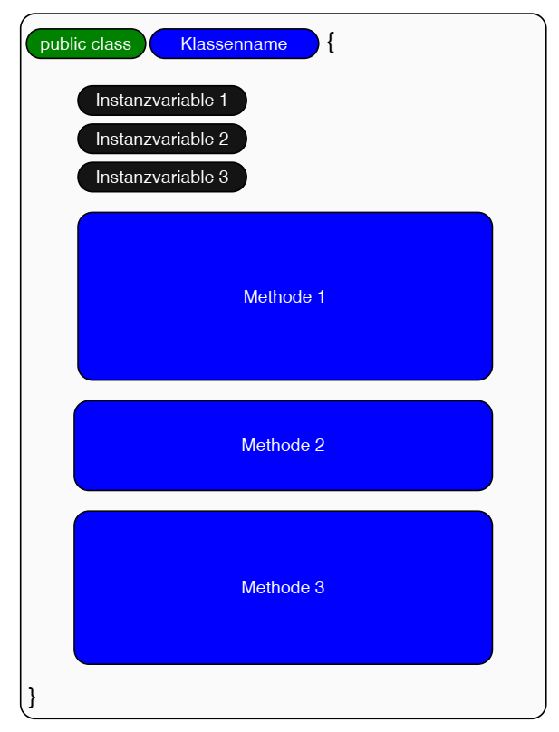
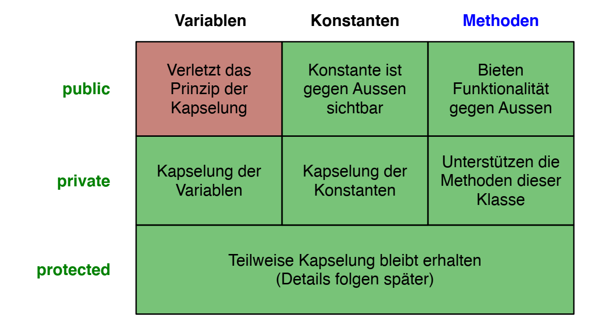
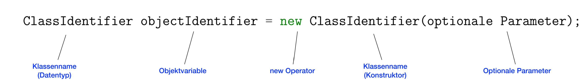
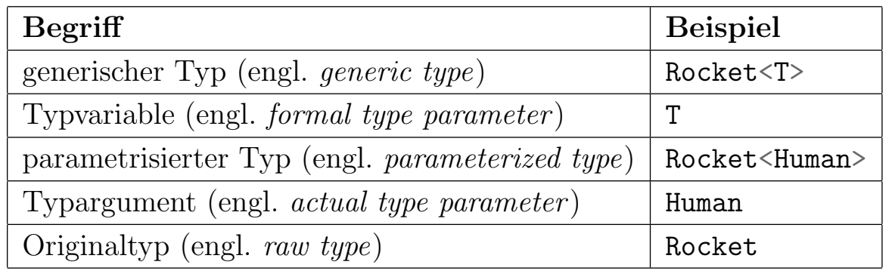

# OOP: Classes, Objects & Methods
**GENERAL: Class definition vs. object instantiation (vs. variable assignment)**:
Class definition outlines the blueprint, while instantiation creates an actual instance (object) based on that blueprint.

## 1) Defining Classes
**Class structure**:



### Class head
`aVisibility class AnyClassName { ... }`
```java
public class MyClass {
    ...
}
```

### Visibility
Variables, constants and methods can be defined with a specific **visibility**:
- **Private**: only visible within the class
- **Public**: also visible and accessible from other classes
- **Protected**: The variable is accessible within the same package and by subclasses (even if they're in a different package)
- If no visibility modifier is specified, the default is "package-private", meaning the variable is accessible within the same package.


### Variables and Constants

Variables that are declared inside a method, are called **local variables**, and can only be used within this method. Their visibility cannot be changed.

Variables declared inside a class but outside methods are called **instance variables** as they are tied to instances (objects) of the class. They are available to all methods of the class. To address an instance variable of the current instance, the **"this.*" keyword** is used, e.g.: `this.points = 3`.

Instance variables are typically defined as "private", such that they are only available within the class. Using **public variables is not recommended**, as this violates the principle of encapsulation.

**Constants** can be private or public, in which case they can be seen as a "service" to external sources.

### Defining Methods

- Private methods = **"support methods"**
- Public methods = **"service methods"**

**Head**:

1. **Visibility** modifier
2. **Data type** that is returned; OR `void` when nothing is returned
3. **Name** of the method

`aVisibility aType aMethodName(aType anArg){ ... }`
```java
public class AnyClass{
    ...
    public int calcDouble(int num){
        ...
    }
}
```

**return**:
```java
return this.anyVar; // an instance variable

return finalResult; // a local variable

... // or any other expression (but only one value/object)
```

### Main Method
The main method contains commands that we want to be **executed** when running the program. It is mandatory for classes that are designed to be the entry point of a Java program.
```java
public class AnyClass{
    ...
    public static void main(String[] args){
        ...
    }
    ...
}
```
### Constructor Method
Is called when **a new instance is created**. Its name is always the same as the class. It contains no return type (also not void, as it returns the address of the instance).

IMPORTANT: There can be **multiple constructors** that differ in the **number/type of arguments** they take. At the instantiation of an object, the suited constructor is automatically chosen based on the input.

```java
public class AnyClass{
    ...
    public AnyClass(aType anArg){
        ... // Define the initial state of the object given an argument
    }
    public AnyClass(){
    ... // Define the initial state of the object given NO argument (e.g. using default values)
}
```

### Static Methods
Methods that can be called **without instantiating an object** of the class, are defined as "static". They belong to the class itself, not to any instance of the class.
```java
public class AnyClass{
    ...
    public static anyType anyMethod(aType anArg){
        ... // Do something independently of any instances...
    }
    ...
}
```


### Getters/Setters
Since instance variables should typically be private, they cannot be accessed from the outside. However, **controlled access** can be granted through methods. Setters grant control as they typically check the input before assigning it to an instance variable, and may include validation or transformations before setting the value.
```java
public class AnyClass{
    ...
    public varType getAnyVar(){
        return anyVar // Could also be that the variable is transformed before...
    }
    ...
}
```
```java
public class AnyClass{
    ...
    public void setAnyVar(aType anArg){
        ... // Usually check input first, and possibly modify it
        this.anyVar = anArg;
    }
    ...
}
```

### toString() Method
The `toString()` method overrides the default implementation from the Object class and **defines the string representation** of the object when printed or concatenated with strings.
```java
public class AnyClass{
    ...
    public String toString() {
        return this.varOne + ": " + this.varTwo; // or any sort of string describing the object
}
```


## 2) Creating Objects & Using Methods

### Creating and Assigning Objects

- We can interpret the class of an object like its data type...
- BUT variables for objects are only **references** to the object (not the value itself)
- **Declare** variable of that Class --> no object yet
- **Instantiate** ("new") --> object created (calls constructor)
- **Assign** to variable --> points to that object
- **Reassign** --> points to **different object (= Aliases)**!
- **Change** object --> **all** variables pointing to it change!

---

**Create object = declare (left), instantiate (right) and assign (=)**:


```java
AnyClass anyObject = new AnyClass(anyParameters);
Circle circle1 = new Circle(40, 40, 10); // Ex.
```
---
### Using Methods and Constants

Call methods of an object: use **dot operator on the Object**

```java
anyObject.anyMethod(anyParameters); // ... of another object
circle1.setCenterX(100); // Ex.
```

Use **static method**: use **dot operator on the Class**
```java
AnyClass.anyMethod(anyParams); // ... static of another class
Quotes.printQuoteOfSteve(); // Ex. method that is pre-defined in the class "Quotes" but independent of an object
```
Inside the class itself, static methods can be called without the dot operator
```java
anyMethod(anyParams); // ... static of this class
printQuoteOfSteve(); // Ex. method that is defined in this class
```
Use **constant**: use **dot operator on the Class**
```java
AnyClass.ANY_CONSTANT
Math.PI // the constant for pi from the Math class of the API
```

### Importing Classes
Imports are done **before class definitions**.
```java
// Examples:
import java.util.Scanner; // import specific Class
import java.util.*; // import all Classes from a Package
```

## 3) Generics
A class can be defined in a way that it **can use objects of multiple types**. For this, it uses a "formal type variable/parameter" (e.g. T). When an object is instatiated, it has to be declared for a certain type through an "type argument" (e.g. <int>). In that object, **any occurence of the formal type variable is then replaced by that type argument**. Generics provide type safety by ensuring that the type used is consistent at compile time.

```java
public class MyGenericClass<T> {
    private T aVar; // Define a variable that can be of various types
    public MyGenericClass(T anyArg) { // constructor
    this.aVar = anyArg; // Set this variable (given an input of the chose type)
    }
    public void setVar(T anyArg) {
        this.aVar = anyArg; // Setter
    }
    ...
}

// Outside, instantiation:
MyGenericClass<aType> objectName = new MyGenericClass<aType>(anyArg);
```

Example:
```java
public class Rocket<T> { // A rocket that can transport different things
    private T cargo; // Instance variabel
    public Rocket(T cargo) { // Constructor
        this.cargo = cargo;
    }

    public void set(T cargo) { // Setter
        this.cargo = cargo;
    }

    public T getCargo() { // Getter
        return this.cargo;
    }
}

// Outside:
Rocket<Dog> dogRocket = new Rocket<Dog>();
Rocket<Human> humanRocket = new Rocket<Human>();
```

