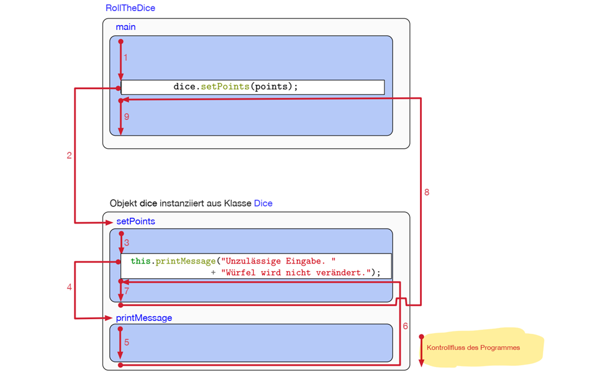

[Back to overview](./00_Java_SyntaxGuide.md)

---
# Commands and Comments
## General Syntax of Commands

- Every (standard) command needs to be ended with a **semicolon** (;)
- Additional **white spaces and indents do not have a relevance** for compilation, but make the code more readable
- Generally, blocks of code that belong together are written within **curly brackets** ({}).

```java
someCode onOne line;
someHead {
    someCode;
    thatIs;
    inOneBlock;
    ...
}
```

## Control Flow
Control flow **follows the calls of the methods**:



## Comments

```java
// comment on one line
```
```java
/*
comment until ended with
*/
```
```java
/**
* automatic generation of documentation
*/
```

---

[Back to overview](./00_Java_SyntaxGuide.md)