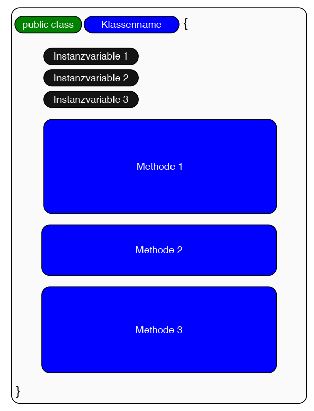
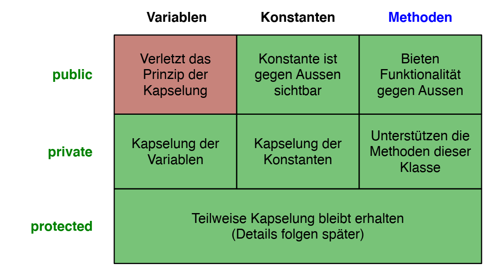

# Classes
[Back to overview](./00_Java_SyntaxGuide)

**GENERAL DISTINCTION: Class definition vs. object instantiation (vs. variable assignment)**

Class definition outlines the blueprint, while instantiation creates an actual instance (object) based on that blueprint. Multiple, different instances/objects of a single class may be built.

**Class structure**:



## Defining a Class

### Class head
`aVisibility class AnyClassName { ... }`
```java
public class MyClass {
    ...
}
```

### Visibility Modifiers
Variables, constants and methods can be defined with a specific **visibility** and its according modifier:
- **Private**: only visible within the class
- **Public**: also visible and accessible from other classes
- **Protected**: The variable is accessible within the same package and by subclasses (even if they're in a different package)
- If no visibility modifier is specified, the default is "package-private", meaning the variable is accessible within the same package.


### Variables and Constants
Variables that are declared inside a method, are called **local variables**, and can only be used within this method. Their visibility cannot be changed.

Variables declared inside a class but outside methods are called **instance variables** as they are tied to instances (objects) of the class. They are available to all methods of the class. To address an instance variable of the current instance, the **"this.*" keyword** is used, e.g.: `this.points = 3`.

Instance variables are typically defined as "private", such that they are only available within the class. Using **public variables is not recommended**, as this violates the principle of encapsulation.

**Constants** can be private or public, in which case they can be seen as a "service" to external sources.

### Static Methods
Methods that belong to the class itself, not to any instance are declared/defined as "static". They can be called **without instantiating an object**.

```java
public class AnyClass{
    ...
    public static anyType anyMethod(aType anArg){
        ... // Do something independently of any instances...
    }
    ...
}
```

### Defining Methods
- Private methods = **"support methods"**
- Public methods = **"service methods"**

**Head**:

1. **Visibility** modifier
2. **Data type** that is returned; OR `void` when nothing is returned
3. **Name** of the method

`aVisibility aType aMethodName(aType anArg){ ... }`
```java
public class AnyClass{
    ...
    public int calcDouble(int num){
        ...
    }
}
```

**return**:
```java
return this.anyVar; // an instance variable

return endResult; // a local variable

... // or any other expression (but only one value/object)
```

## Special Methods

### Main Method
The main method contains commands that we want to be **executed** when running the program. It is mandatory for classes that are designed to be the entry point of a Java program.
```java
public class AnyClass{
    ...
    public static void main(String[] args){
        ...
    }
    ...
}
```

### Constructor Method
Is called when **a new instance is created**. Its name is always the same as the class. It contains no return type (also not void, as it returns the address of the instance).

IMPORTANT: There can be **multiple constructors** that differ in the **number/type of arguments** they take. At the instantiation of an object, the suited constructor is automatically chosen based on the input.

```java
public class AnyClass{
    ...
    public AnyClass(aType anArg){
        ... // Define the initial state of the object given an argument
    }
    public AnyClass(){
    ... // Define the initial state of the object given NO argument (e.g. using default values)
}
```

### Getters/Setters
Since instance variables should typically be private, they cannot be accessed from the outside. However, **controlled access** can be granted through methods. Setters grant control as they typically check the input before assigning it to an instance variable, and may include validation or transformations before setting the value.
```java
public class AnyClass{
    ...
    public varType getAnyVar(){
        return anyVar // Could also be that the variable is transformed before...
    }
    ...
}
```
```java
public class AnyClass{
    ...
    public void setAnyVar(aType anArg){
        ... // Usually check input first, and possibly modify it
        this.anyVar = anArg;
    }
    ...
}
```

### toString() Method
The `toString()` method overrides the default implementation from the Object class and **defines the string representation** of the object when printed or concatenated with strings.
```java
public class AnyClass{
    ...
    public String toString() {
        return this.varOne + ": " + this.varTwo; // or any sort of string describing the object
}
```

---

[Back to overview](./00_Java_SyntaxGuide)
