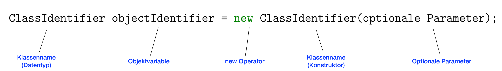

# Objects and Methods
[Back to overview](./00_Java_SyntaxGuide)

## Creating and Assigning Objects

- We can interpret the class of an object like its data type...
- BUT variables for objects are only **references** to the object (not the value itself)
- **Declare** variable of that Class --> no object yet
- **Instantiate** ("new") --> object created (calls constructor)
- **Assign** to variable --> points to that object
- **Reassign** --> points to **different object (= Aliases)**!
- **Change** object --> **all** variables pointing to it change!

---

**Create object = declare (left), instantiate (right) and assign (=)**:


```java
AnyClass anyObject = new AnyClass(anyParameters);
Circle circle1 = new Circle(40, 40, 10); // Ex.
```
---
## Using Methods and Constants

Call methods of an object: use **dot operator on the Object**
```java
anyObject.anyMethod(anyParameters); // ... of another object
circle1.setCenterX(100); // Ex.
```

To use a **static method** or access a **static constant**, we apply the **dot operator on the Class**:
```java
AnyClass.anyMethod(anyParams); // ... static of another class
Quotes.printQuoteOfSteve(); // Ex. method that is pre-defined in the class "Quotes" but independent of an object
```
```java
AnyClass.ANY_CONSTANT; // using static constants (outside the class)
double circleCirc = circleDiam * Math.PI; // Using the pi constant from Math module
```

**Inside the class** itself, static methods and static constants (or variables) can be called/accessed without the dot operator:
```java
anyMethod(anyParams); // ... static of this class
printQuoteOfSteve(); // Ex. method that is defined in this class
```

Note: There can also be **non-static constants** (declared outside methods, and can be public or private). They belong to an instance - and are therefore addressed by the dot operator on the object (from outside) or using `this. ` (inside the class) - and are set once, e.g. in the constructor. Like this, the constant can be set for the instance and then used for its lifetime.
```java
// Example:
class Car {
    private final int maxSpeed;
    
    public Car(int maxSpeedIn) {
        this.maxSpeed = maxSpeedIn; // Setting the constant to the input at the instantiation
    }
}
```

*For an overview over possible variable and constant types, see Chapter [Variable Types](06_Variable_Types.md).*

## Importing Classes

Imports are done **before class definitions**.
```java
// Examples:
import java.util.Scanner; // import specific Class
import java.util.*; // import all Classes from a Package
```

---

[Back to overview](./00_Java_SyntaxGuide)
