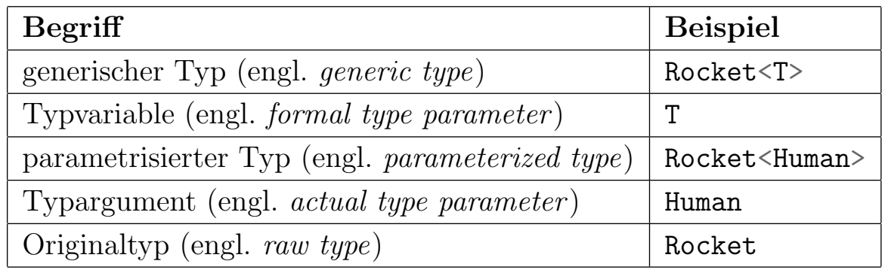

[Previous Chapter: Variable Types](./06_Variable_Types.md) | [Back to overview](./00_Java_SyntaxGuide.md)

---
# Generics

## Generic Classes

- A class can be defined in a way that it **can use objects of multiple types**
- For this, it **uses a "formal type variable" / "type parameter"** (e.g. `<T>`) in the defintion
    - By convention, T is used for a single generic type, but you can use other letters (e.g., K, V, E) or descriptive names for clarity.
    - You can define multiple type parameters if the class (or method) needs them, e.g., `<T, U>` for two types.
- When an object is instatiated, it has to be **declared for a certain type through a "type argument"** (e.g. `<int>`)
- In that object, **any occurence of the formal type variable is then replaced by that type argument**
- Generics **provide type safety** by ensuring that the type used is consistent at compile time.

```java
public class MyGenericClass<T> {

    private T aVar; // Define a variable that can be of various types

    public MyGenericClass(T anyArg) { // constructor
        this.aVar = anyArg; // Set this variable (given an input of the chosen type)
    }

    public void setVar(T anyArg) {
        this.aVar = anyArg; // Setter
    }
    ...
}

// Outside, instantiation:
MyGenericClass<aType> objectName = new MyGenericClass<aType>(anyArg);
// Example:
MyGenericClass<Integer> intObject = new MyGenericClass<Integer>(5);
```

**Example:**

```java
public class Rocket<T> { // A rocket that can transport different things
    private T cargo; // Instance variabel

    public Rocket(T cargo) { // Constructor
        this.cargo = cargo;
    }

    public void set(T cargo) { // Setter
        this.cargo = cargo;
    }

    public T getCargo() { // Getter
        return this.cargo;
    }
}

// Outside, instantiation:
Rocket<Dog> dogRocket = new Rocket<Dog>(); // Rocket for dogs
Rocket<Human> humanRocket = new Rocket<Human>(); // Rocket for humans
```



<div style="page-break-before: always;"></div>

## Generic Methods

- **Before the return type** in the method signature, declare one or more **generic type parameters** using angle brackets (`<T>`, `<T, U>`, etc.)
- **Define T through arguments of the method**, such that the compiler can then **infer the type** which T should take based on the arguments.

*Sidenote: When you declare `<T>` in a generic method, it’s only valid within that method;  if you declare <T> at the class level, it applies to all methods in the class.*

```java
// Example 1
public static <T> void insertionSort(Comparable<T>[] list){
    ...
}

// Example 2
// Generic for the type T, given an array of type T (=T[])
// returning the first element of the array (being of type T)
public static <T> T getFirstElement(T[] array) {
    if (array == null || array.length == 0) return null;
    return array[0];
}
```

When **calling the method**, the compiler automatically **infers the type based on the arguments** passed.

```java
Integer[] intArray = {1, 2, 3};
System.out.println(getFirstElement(intArray));  // Compiler infers T as Integer

String[] strArray = {"a", "b", "c"};
System.out.println(getFirstElement(strArray));  // Compiler infers T as String
```


---

[Next Chapter: Conditions](./08_Conditions.md) | [Back to overview](./00_Java_SyntaxGuide.md)