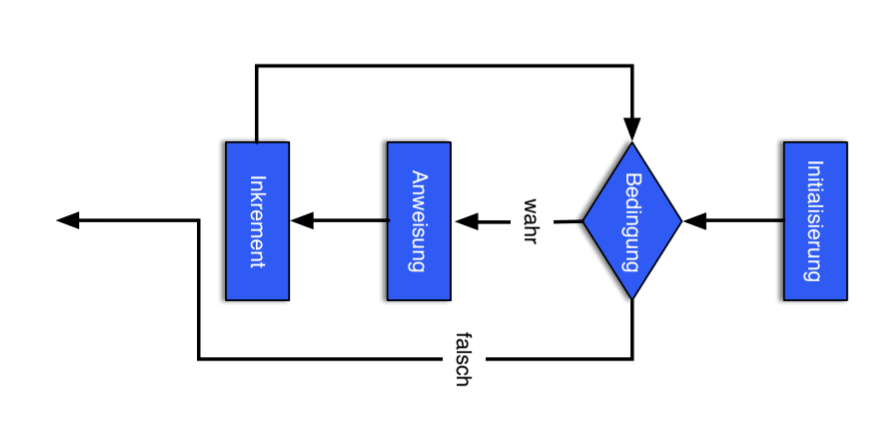

[Back to overview](./00_Java_SyntaxGuide.md)

---
# Loops

## While Loops
```java
while ( boolExpre­ssion ) {
 ­ ... ­st­ate­ments
}
```


## Do While Loops

```java
do {
 ­ ... ­st­ate­ments
} while ( boolExpre­ssion );
```


## For Loops



### For with a variable

- **Inititalization** of the variable (executed *once*)
- **Condition** (checked *before* each entry into loop)
- **Update** of variable (executed *after* each iteration; can basically be *any change* to the variable)

IMPORTANT: The variable used for the loop **should not be changed in the loop**!

```java
// GENERAL SYNTAX
for (loopVar = initVal; boolWithVar; updateOfVar)
    ...

// OR with curly braces
for (loopVar = initVal; boolWithVar; updateOfVar) {
    ...
}

// Example:
for (int count = 1; count <= 3; count++)
    System.out.println(count);

// can use a variable that we declared before
int count;
for (count = 1; count <= 3; count++)
    System.out.println(count);

// Can also decrement
for (int count = 100; count > 0; count--)
    System.out.println(count);
```

### For-each (with iterable)

```java
for (elementType tempElementName : objWithIterator)
    ...

// OR with curly braces
for (elementType tempElementName : objWithIterator) {
    ...
}

// Example:    
for (String bandMember : band)
    System.out.println(bandMember);
```

---

[Back to overview](./00_Java_SyntaxGuide.md)
