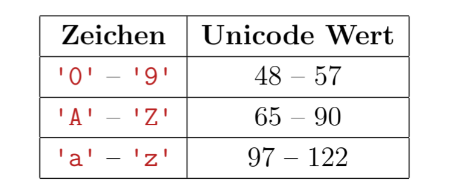

[Back to overview](./00_Java_SyntaxGuide.md)

---
# Using Java API classes

## Strings

IMPORTANT: String is **NOT a primitive data type**, but a class!

However, it is an exception in that it can be **created without "new" command and without explicitly calling the constructor**:

NOTE: Use **DOUBLE quotes**! (single quotes not supported as in python, since they are reserved for characters...)

```java
String aVarName = "arbitrary text"
```

- **Escape symbol**: use `\`; especially `\"` for an actual double quote
- **Shortcut for concatenation**: e.g. `"abc" + "def" + 1` or `234 + " points"`; other types are **auto-converted if any one is a String**.
- Strings are **immutable** --> all methods **return a new String object**

**Methods** (examples):
- `String(`String `p)`: constructor; instantiates together with *new* operator a string object
- char `charAt(`int `index)`: character at position *index*
- String `concat(`String `p)`: object + p
- boolean `equals(`String `p)`: whether exactly same characters and order
- boolean `equalsIgnoreCase(`String `p)`
- int `compareTo(`String `p)`: positive if code is larger than p, negative if smaller, 0 if equal (Unicode stepwise from left to right, see below)
- int `length()`
- String `replace(`char `oldChar, `char `newChar)`
- String `substring(`int `offset, `int `endIndex)`: from (incl.) offset to endIndex (excl.)
- String `toLowerCase()`
- String `toUpperCase()`
- String `trim()`: remove leading and trailing whitespaces
- String[] `split(`String `regex)`: split string at regex and return array of strings




<div style="page-break-before: always;"></div>


## System (Output/Input)

Does **not** need to be **imported**.

### Standard Output
`System.out`, output stream used for standard output (used mostly for print/println commands).
```java
System.out.println("arbitrary text") // prints with trailing line break
System.out.print("arbitrary text") // prints without line break
// NOTE: System.out =^ Objekt; repräsentiert Ausgabegerät
```

### Standard Input
`System.in`, input stream, usually used as a parameter to the Scanner class, see below.
```java
// Define system input as source for Scanner
Scanner scan = new Scanner(System.in);
String arbitraryStringVar = scan.next();
```

### Standard Error
`System.err`, output stream used for error messages (mostly used for print/println commands in red).

## Scanner
```java
import java.util.Scanner
```

- `Scanner(`InputStream `source)`: constructor for a stream (e.g. System.in)
    - other types: (File source) or (String source)
- String`next()`: next String element; default delimiter = space
- String `nextLine()`
- int `nextInt()` | double `nextDouble()` | boolean `nextBoolean()` -> error if type msimatch
- Scanner `useDelimiter(`String `pattern)`: define delimiter (in this Scanner object)
- boolean `hasNext()`: whether there are any more items after last scan

```java
// Example 1:
Scanner nameScanner = new Scanner(namesFile);
nameScanner.useDelimiter(", ");
String name1 = nameScanner.next();
String name2 = nameScanner.next();
...

// Example 2:
Scanner inputScanner = new Scanner(System.in);
String arbitraryStringVar = inputScanner.next();
int arbitraryIntVar = inputScanner.nextInt();
double arbitraryDoubleVar = inputScanner.nextDouble();
```

<div style="page-break-before: always;"></div>

## PrintWriter
```java
import java.io.PrintWriter;
```

- `PrintWriter(`String `fileName)`: constructor; creates a file with the given name
- void `print(`String `p)`: print string p
- void `println(`String `p)`: print string p with line break at the end
- void `close()`: close the file; **mandatory** to ensure all changes are saved !

```java
PrintWriter outFile = new PrintWriter(fileName); // create a file

final int MAX = 10;
for (int line = 1; line <= MAX; line++) {
    for (int num = line; num <= MAX; num++) {
        outFile.print(num * 2 + " "); // write to file
    }
    outFile.println(); // write line break to file
}
outFile.close(); // close file
```

NOTE: PrintWriter can throw an **IOException** (e.g. if file not found or not writable), which must be caught or declared in the method signature, and the Exception must be imported (see chapter [Exceptions](./16_Exceptions.md)).

```java
import java.io.IOException;
```

## Random
```java
import java.util.Random;
```

- `Random()`: constructor
- float `nextFloat()`: float between 0.0 (incl.) and 1.0 (excl.)
- int `nextInt()`: int between -2147483648 and 2147483647
- int `nextInt(`int `max)`: int between 0 and max (excl.)

**Adjust and combine** to the needs (e.g. add and multiply to move boarders and extend range) !

<div style="page-break-before: always;"></div>

## DecimalFormat

```java
import java.text.DecimalFormat;
```

- `DecimalFormat(`String `p)`: constructor; p = pattern for formatting (see below)
- String `format(`double `num)`: format "num" according to pattern
- void `applyPattern(`String `p)`: re-define pattern

**Pattern**:
- "0": enforce to show this position with leading/trailing zeroes
- "#": show only if necessary
- ".": define where decimal
- ",": define where '
- "%": use in % (--> *100 & add "%")
- Other characters: used as is

```java
// Examples:

DecimalFormat df = new DecimalFormat("0.00");
double num = 123.456;
String formattedNum = df.format(num); // "123.46"

DecimalFormat df2 = new DecimalFormat("0.0%");
double num2 = 0.123;
String formattedNum2 = df2.format(num2); // "12.3%"

// With # and ':
DecimalFormat df3 = new DecimalFormat("#,###.00");
double num3 = 1234567.89;
String formattedNum3 = df3.format(num3); // "1,234,567.89"
double num4 = 123.4;
String formattedNum4 = df3.format(num4); // "123.40"
```

## Math
Does **not** need to be **imported**.

All methods are **static**, i.e. can be called directly on the class, without instantiating an object (e.g. `Math.abs(-5)`):

- static double `abs(`double `num)`: Absolute value
- static double `cos(`double `angle)`: Cosine | Similarly: `sin()` und `tan()`
- static long `round(`double `num)`: Round to closest integer (pre-/post-process for other rounding)
- static double `ceil(`double `num)`
- static double `floor(`double `num)`
- static double `pow(`double `x, `double `y)`: x^y
static double sqrt(`double `x): x^0.5
- static double `min(`double `x, `double `y)` | Similarly: `max()`
- static double `random()`: between 0.0 (incl.) and 1.0 (excl.)

<div style="page-break-before: always;"></div>

## Wrapper Classes

To each primitive data type, there exists a class that wraps it and **can hold and work with values of that type**. They are particularly useful in cases where it is necessary to use objects and not primitive data types.

**Wrapper Class Names:**
- Same as primitive data type but with **capital first letter**
- **Exceptions: Integer instead of Int and Character instead of Char.**

**Autoboxing and Unboxing** is easy:

```java
Integer obj = 69; // auto-instantiation of Integer object
int num = obj; // auto-extraction of int value
```

For **parsing**, numerical Wrapper functions contain *static* parse methods to convert a string to a number:
```java
String strNum = "987";
int num = Integer.parseInt(strNum);
```

The *static* **toString methods** do the opposite, converting a number to a string:
```java
int num = 987;
String strNum = Integer.toString(num);
```

<div style="page-break-before: always;"></div>

## ArrayList

- Save a **list of objects of the same type**
- Allow access and modifications through **integer indices**
- ArrayList is a **generic** class, meaning the user can instantiate a parametrised type that can hold objects of one defined type.
- Importantly, ArrayLists **can only store objects**, NOT primitive data types; this suggests using wrapper classes mentioned above

*Sidenote: ArrayLists are just one example from java's **collection framework**, which provides many other data structures (e.g. LinkedList, HashSet, HashMap, etc.)*

Type specification:
- At the declaration, the user **specifies the type of the objects that can be contained** in the ArrayList
- Naturally, the assigned object must be instantiated with a compatible type (typically the same)
- In cases of polymorphism, the ArrayList can be instantiated with a superclass/interface type, and objects of subclasses/interface-implementing-classes can be added (see [15_Polymorphism](./15_Polymorphism_and_InhVsInt.md)).
- Defining an ArrayList without type specification (holding any types) is possible, but not recommended.

```java
import java.util.ArrayList;

// Declaration and instantiation with the same type
ArrayList<aType> aVarName = new ArrayList<aType>();

// Example:
ArrayList<String> names = new ArrayList<String>();
```
- ```ArrayList<E>()```: Constructor, instantiates an empty list that can take objects of type E
- boolean `add(`E `obj)`: Adds object `obj` of type "E" at the end, returns `true` if successful
- void `add(`int `i, `E `obj)`: Adds object `obj` of type "E" at position i, shifts object currently at this position and all following objects back by one, returns `true` if successful
- E `set(`int `i, `E `obj)`: Replaces the object at position i with obj, returns the replaced object
- E `get(`int `i)`: Returns the element at position i
- void `clear()`: Removes all elements from the list
- E `remove(`int `i)`: Removes the element at position i from the list and returns it
- int `indexOf(`E `obj)`: Returns the (smallest) index of the object obj in list; returns -1, if obj does not exist in this list
- boolean `contains(`E `obj)`: whether object present at least once
- boolean `isEmpty()`
- int `size()`: number of objects saved in list
- String `toString()`: "[X, Y ... ]" where X, Y etc. are the objects in string form

NOTE: methods using an index return a runtime error if the index is not valid

---

[Back to overview](./00_Java_SyntaxGuide.md)
