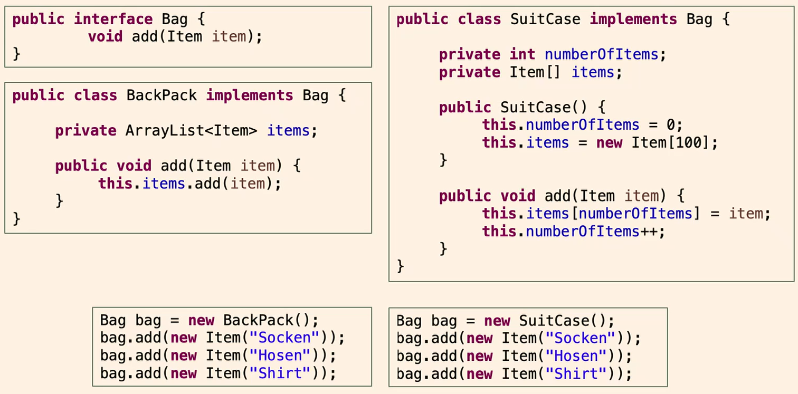

[Back to overview](./00_Java_SyntaxGuide.md)

---

# Polymorphism

- Polymorphism is the ability of an object to take on many forms, meaning that a **reference variable of a superclass or interface can refer to an object of any subclass or class implementing the interface**.
- This allows for **flexibility** in the code, as the same method can be used for different objects, achieved through method overriding or implementing abstract methods.
- It also enables to hide implementation details, as the **specific type is not known** at compile time.
- Notably, it allows to **define arrays that contain objects of different subclasstypeses** but share the relevant behavior/perspective, and to call methods on them.
- Important: Only subclasses that extend the superclass or implement the interface can be used in this way, therefore allowing for type safety.

```java
    // Polymorphism
    TheSuperclass obj = new TheSubclass();
    obj.aMethod(); // Calls the method of the subclass

    // Example:
    Book book = new Dictionary(33);
    book.printTitle(); // Calls the method of the subclass

    // Example with arrays
    // Array for various beverage objects
    Beverage[] beverages = new Beverage[6];
    beverages[0] = new SoftDrink("Cola", 33, true);
    beverages[1] = new Wine("Bordeaux", 10, 0.168);
    beverages[2] = new Beer("Felsenau Junker", 33);
    Beverage beverage; // polymorphic variable
    // Output of the effect of drinking all beverage objects
    System.out.println("All drinks:");
    for (int i = 0; i < beverages.length; i++){
        beverage = beverages[i]; // polymorphic assignment !!!
        // Only at runtime, the actual object type is determined
        System.out.println(beverage.drink()); // polymorphic method call !!!
        // Method "drink" is defined by superclass (or interface), but must be present --> shared behavior/perspective
    }
```

**EXAMPLE WITH INTERFACES**:

**Advantage**: We can write code, and later **exchange the BackPack by SuitCase**, and the overall behavioiur stays, since they both implement the interface Bag. So, we can work with "Bags", and only later define detailed behaviours by implementing the interface in different classes. This is a **very powerful concept** in Java, and is used in many libraries and frameworks.


# Inheritance vs. Interfaces
| **Feature**                     | **Superclasses**                                                                           | **Interfaces**                                                                                 |
|----------------------------------|-------------------------------------------------------------------------------------------|-----------------------------------------------------------------------------------------------|
| **Number allowed**              | A class can extend only one superclass (single inheritance).                              | A class can implement multiple interfaces.                                                    |
| **Keyword for inheritance**     | `extends`                                                                                 | `implements`                                                                                  |
| **Use of `.super` vs. `??`**    | `.super` is used to call methods or constructors from the superclass.                     | Interfaces do not have constructors or direct parent calls like `.super`.                     |
| **Default methods**             | Superclasses naturally provide method implementations.                                    | Can have `default` methods with an implementation (introduced in Java 8).                    |
| **Abstract methods**            | Abstract methods require the `abstract` keyword.                                          | Methods are implicitly abstract (no `abstract` keyword needed unless explicitly specified).    |
| **Necessity of implementation** | A class must implement all abstract methods from its superclass unless it’s abstract.     | A class must implement all abstract methods from all interfaces unless it’s abstract itself. |
| **What is inherited**           | Fields, methods (including concrete and abstract), and some behavior are inherited.       | No concrete methods or fields (except static and default methods) are inherited.              |
| **Constructors**                | Superclasses can have constructors, which are called with `super()` from the subclass.    | Interfaces cannot have constructors.                                                          |
| **Polymorphism**                | A subclass can be referenced as its superclass type.                                      | A class can be referenced by any of its implemented interfaces.                               |
| **Syntax for defining**         | `class SuperclassName { ... }`                                                            | `interface InterfaceName { ... }`                                                             |
| **Syntax for extending/implementing** | `class SubClass extends Superclass { ... }`                                               | `class SubClass implements Interface1, Interface2 { ... }`                                       |
---

## **Role of Abstract Superclasses**
Abstract superclasses are a step towards interfaces as they allow partial implementation through both abstract and concrete methods and cannot be instantiated. However, they still follow the principle of inheritance, including single inheritance, the ability to define instance fields (inherited by subclasses), and the use of constructors for initializing state. Their purpose is to serve as a mechanism for code reuse and a base for polymorphism, while interfaces are primarily for defining a contract or API that multiple unrelated classes can adhere to.


---

[Back to overview](./00_Java_SyntaxGuide.md)