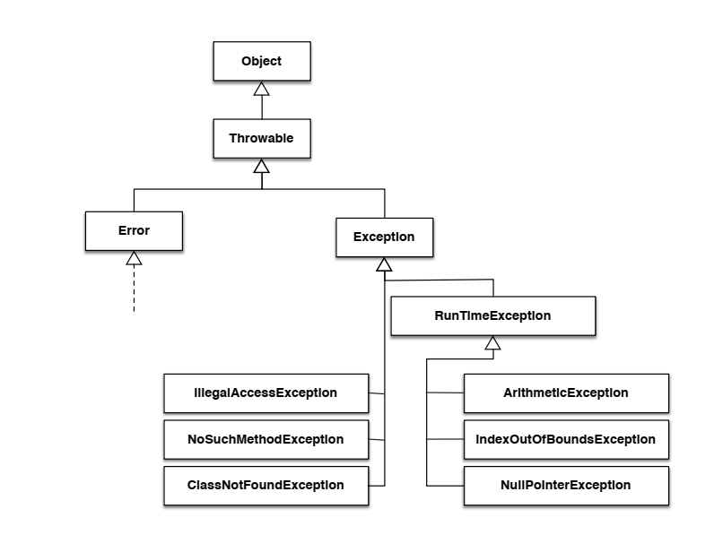
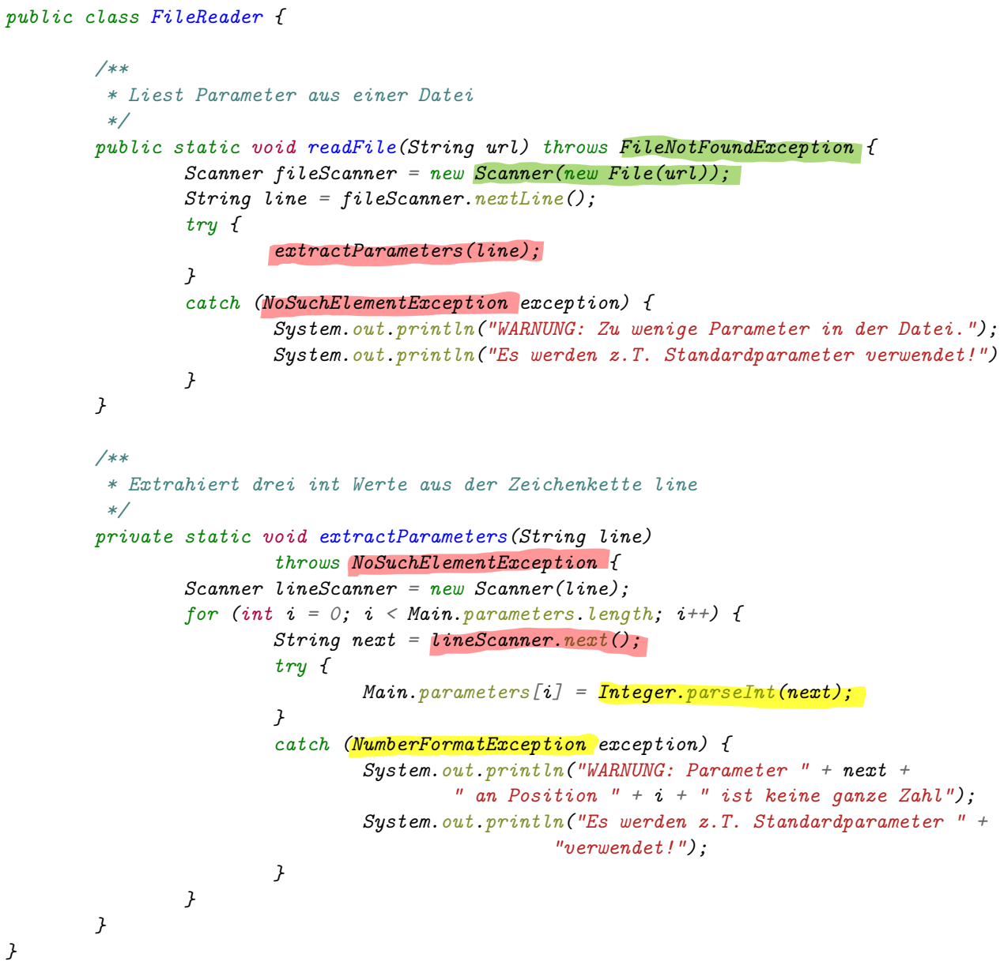
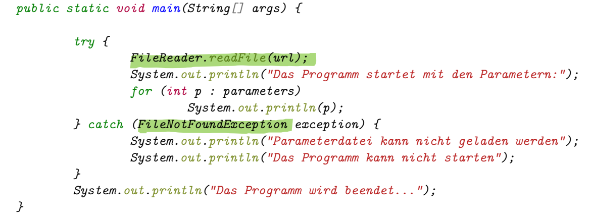

[Back to overview](./00_Java_SyntaxGuide.md)

---

# Exceptions

## General

- **Exceptions** are events that occur during the execution of a program that disrupt the normal flow of instructions.
- In java, exceptions are objects of the class `Exception` that are **thrown** when an exceptional event occurs.
- An ***error*** on the other hand is an object of the class `Error` that is thrown when a serious problem occurs that is beyond the control of the program.
- Exceptions can be **checked** or **unchecked**:
  - **Checked exceptions** are exceptions that must be **handled** (i.e., caught or declared) by the programmer, or the program will not compile.
  - **Unchecked exceptions** (= subclasses of `RuntimeException`, like `ArithmeticException` or `NullPointerException`) are exceptions that do not have to be handled, but can be handled if desired.



## NOT handling exceptions

- If an exception is not handled at all, the program will **terminate** and an error message will be displayed.
- The **error message** will contain the **name** of the exception (i.e., the subclass) , the **description** of the exception (optional), and the **stack trace** (sequence of method calls that led to the exception).

## Handling exceptions

### Catching exceptions - the `try`-`catch` block

- The `try` block contains the code that **might throw** an exception.
- The `catch` block contains the code that **handles** the exception.
- The `finally` block contains the code that **is always executed**.
- Important: After execution of the `catch` block, the program **continues** with the code **after the entire `try-catch` block**.

```java
try {
    someObject.someMethod(); // might throw an exception
    someOtherObject.someOtherMethod(); // will not be executed if an exception is thrown !
} catch (ExceptionType1 e1) {
    ... // handles the exception
} catch (ExceptionType2 e2) {
    ... // handles the exception of another type
} finally {
    ... // is always executed
}

// EXAMPLE
try {
    System.out.println("Please enter a number: ");
    int number = scan.nextInt(); // throws an exception if the user enters a non-integer
    System.out.println("You entered: " + number); // not executed if exception thrown
    System.out.println("The invert of the number is: " + 1/number); // throws an exception if user enters 0
} catch (InputMismatchException e) { // handles exception of invalid input
    System.out.println("Please enter a valid number!");
} catch (ArithmeticException e) { // handles exception of division by zero
    System.out.println("You cannot divide by zero!");
} finally {
    scan.close(); // closes the scanner in any case
}
```

Each subclass of Èxception` provides at least the **two methods `getMessage()` and `printStackTrace()`**, which can be used to provide more information when handling exceptions.

### Passing exceptions - the `throws` keyword

- If a method calls another method that throws an exception, the **exception must be caught or passed** to the calling method.
- If a method might throw an exception, and does not handle it itself, it **must be declared with the `throws` keyword**, allowing to pass the exception to the calling method.
- If the exception is passed to the calling method, the **control is directly passed** to the calling method's `catch` block (without executing the code after the method call).
- If the calling methods itself does not handle the exception, it must be passed to the next higher method, and so on, until the exception is handled.





## Writing custom exceptions

- Custom exceptions can be created by **extending the class `Exception`** or one of its subclasses (creating a new subclass through inheritance).
- Custom exceptions are created to **provide more information** about the exception, or to **differentiate between different types of exceptions**.
- Often, they are just an extending `Exception` class with a **constructor** that calls the constructor of the superclass, providing additional information for creating the message (getMesssage() method).

```java
public class EmptyInputException extends Exception {
    public EmptyInputException(String missingInput) {
        // Calling the constructor of the superclass, providing the message (using additional information)
        super("The input " + missingInput + " is empty!");
    }
}
```

Once defined, custom exceptions can be **thrown** and **handled** like any other exception.

```java
public static void main(String[] args) {
    try {
        readInputFromUser(); // Using the method that might throw the custom exception
    } catch (EmptyInputException e) { // Handling the custom exception
        System.out.println("Eingabe unvollständig!");
        System.out.println(e.getMessage());
    }
}

/**
 * Liest Namen und Alter des Benutzers ein. Wirft eine
 * Exception, falls eine der beiden Angaben fehlt.
 */
private static void readInputFromUser() throws EmptyInputException { // Passing the custom exception
    Scanner scan = new Scanner(System.in);
    System.out.print("Geben Sie Ihren Namen ein: ");
    String name = scan.nextLine();
    System.out.print("Geben Sie Ihr Alter ein: ");
    String age = scan.nextLine();
    
    if (name.length() == 0) // Throwing the custom exception (with the info that the name is missing)
        throw new EmptyInputException("Name"); 
    if (age.length() == 0) // Throwing the custom exception (with the info that the age is missing)
        throw new EmptyInputException("Alter"); 
}
```

---

[Back to overview](./00_Java_SyntaxGuide.md)